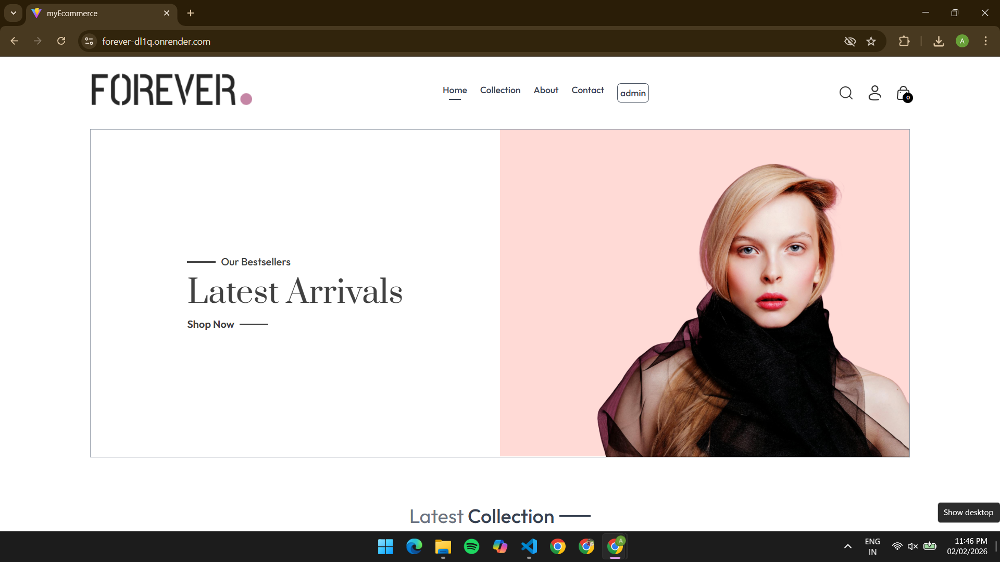
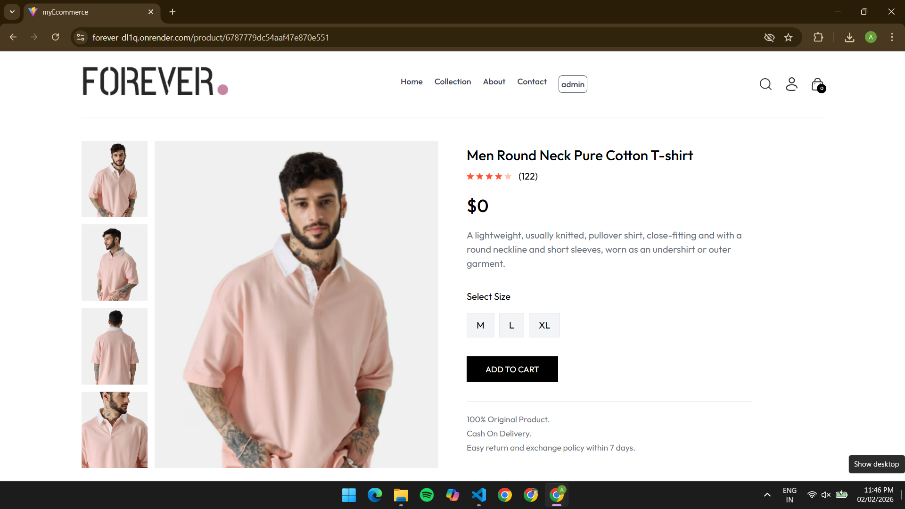

# CommerceX – Full Stack E-Commerce Platform with Recommendation Engine

Modern full‑stack e‑commerce app with a customer storefront, admin dashboard, and REST API built using React, Node.js, Express, and MongoDB.

## 🌐 Live Demo

**[View Live Application](https://forever-dl1q.onrender.com/)**

## 🖼️ Screenshots

Customer Home



Product Details



Collections Page


## 🚀 Highlights

- Customer storefront with product listing, search/filter, cart, checkout, and orders
- Admin dashboard for product, inventory, and order management
- Secure auth with JWT, bcrypt, and role‑based admin access
- Image upload with Cloudinary and payments via Razorpay + COD
- Responsive UI built with React, Vite, and Tailwind CSS

## 🛠️ Tech Stack

## ⚙️ Getting Started

Clone and install dependencies:

```bash
git clone <repository-url>
cd "Full Stack/Ecommerce"
npm install
```

Backend env (create backend/.env):

```env
MONGODB_URI=your_mongodb_connection_string
JWT_SECRET=your_jwt_secret_key
ADMIN_EMAIL=admin@example.com
ADMIN_PASSWORD=admin_password
CLOUDINARY_NAME=your_cloudinary_name
CLOUDINARY_API_KEY=your_cloudinary_api_key
CLOUDINARY_SECRET_KEY=your_cloudinary_secret_key
RAZORPAY_KEY_ID=your_razorpay_key_id
RAZORPAY_KEY_SECRET=your_razorpay_key_secret
PORT=4000
NODE_ENV=development
FRONTEND_URL=http://localhost:5173
```

Install frontend and admin dependencies:

```bash
cd frontend && npm install
cd ../admin && npm install
```

Run in development:

```bash
# backend (from backend/)
npm start

# frontend (from frontend/)


# admin (from admin/)
---
```

## 📁 Project Structure

```text
Ecommerce/
├── backend/      # Express API, MongoDB, auth, payments
├── frontend/     # Customer‑facing React app
└── admin/        # Admin React dashboard
```

## Security Notes

Remaining high-severity vulnerabilities (as reported by `npm audit`) are transitive dependencies related to the `bcrypt` native module build chain (e.g., `@mapbox/node-pre-gyp` → `tar`, and `glob` → `minimatch`). These require major version upgrades and will be addressed in a controlled Phase 2 hardening/refactor.

---

Built as a portfolio project to showcase full‑stack e‑commerce architecture, security, and integration skills.

**Note**: This is a full-stack e-commerce application designed for learning and development purposes. For production use, ensure proper security measures, testing, and compliance with local regulations.
